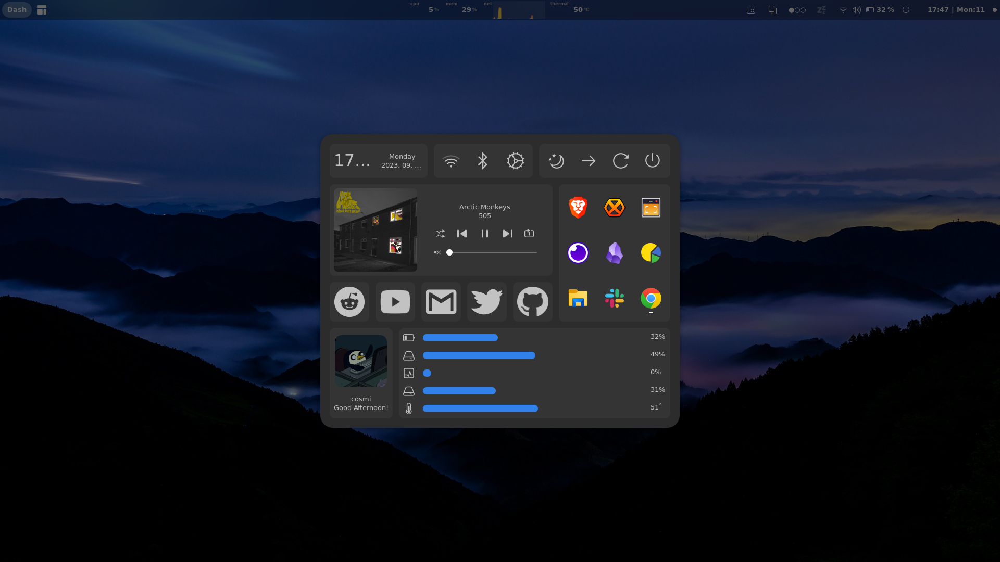
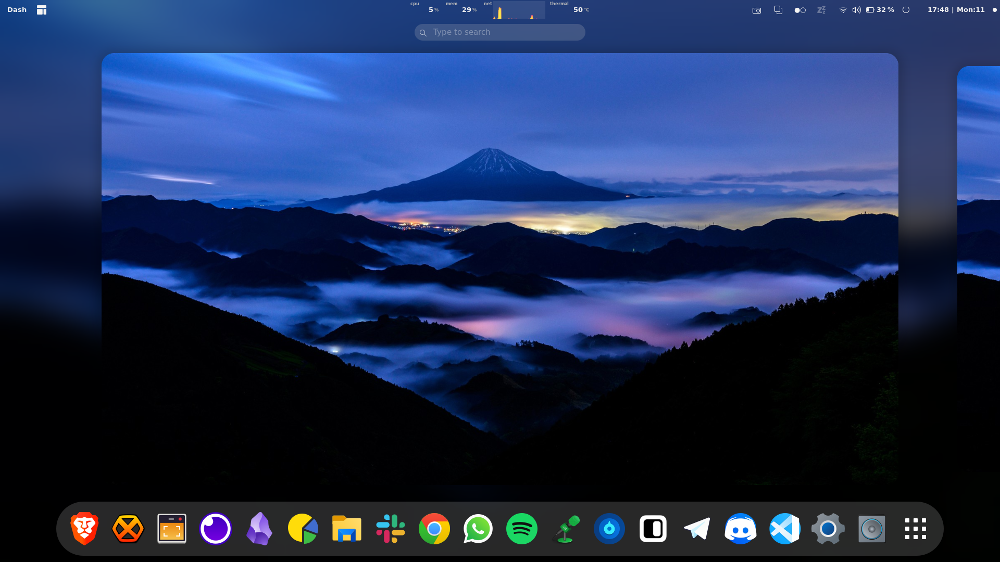
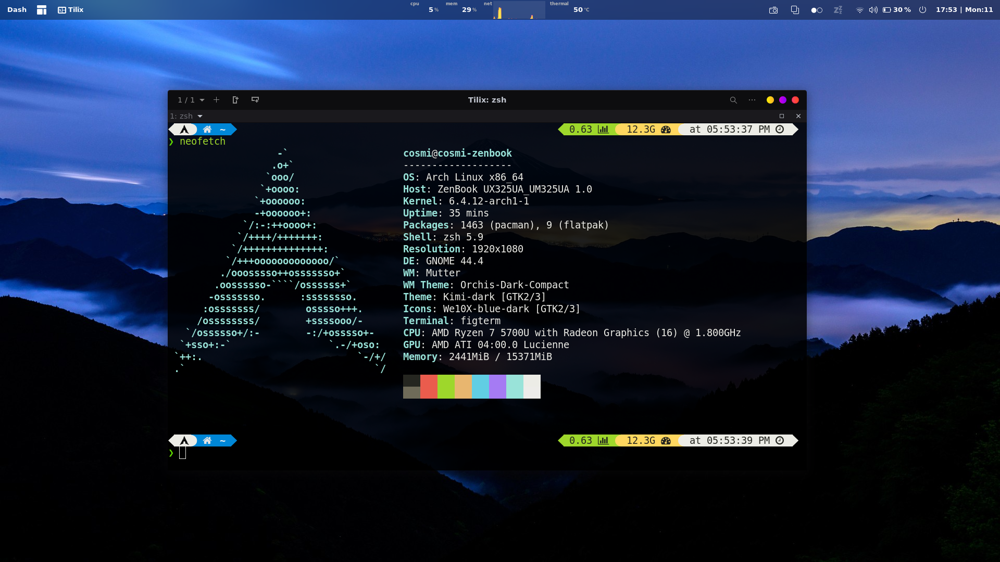

# Dotfiles  :spiral_notepad:
Hi! :wave:, this dotfiles contains my custom desktop enviorment configurations, wallpapers and scripts. :woman_technologist: hope u rlly enjoy :blush:

# Screenshots :camera_flash:

# Setup :gear:
* **OS:** Arch linux 
* **Terminal:** [Tilix](https://gnunn1.github.io/tilix-web/)
* **Spotify theme:** [Spicetify](https://github.com/khanhas/spicetify-cli)
    * **Spicetify Theme:** [Sleek](https://github.com/morpheusthewhite/spicetify-themes/blob/master/THEMES.md#sleek) 
    * **Spicetify color-scheme:** Deep 
* **Browsers:** Chrome, [Brave](https://brave.com/) 
* **File Manager (terminal):** [lf](https://github.com/gokcehan/lf)
* **File manager:** Files
* **Text Editors:** 
    * [Neovim](https://github.com/rockerBOO/awesome-neovim)
        * **Plugins**:
            * [pgsql.vim](https://github.com/lifepillar/pgsql.vim)
            * [vim-devicons](https://github.com/ryanoasis/vim-devicons)
            * [lightline.vim](https://github.com/itchyny/lightline.vim)
            * [vim-asciidoctor](https://github.com/habamax/vim-asciidoctor)
            * [telescope.nvim](https://github.com/nvim-telescope/telescope.nvim)
            * [vim-terminal](https://github.com/tc50cal/vim-terminal)
            * [vim-commentary](https://github.com/tpope/vim-commentary)
            * [vim-css-color](https://github.com/ap/vim-css-color)
            * [nerdtree](https://github.com/preservim/nerdtree)
            * [plenary.nvim](https://github.com/nvim-lua/plenary.nvim)
            * [awesome-vim-colorschemes](https://github.com/rafi/awesome-vim-colorschemes)
            * [vim-dispatch](https://github.com/tpope/vim-dispatch)
            * [vim-surround](https://github.com/tpope/vim-surround)
            * [vim-multiple-cursors](https://github.com/terryma/vim-multiple-cursors)
            * [vim-closetag](https://github.com/alvan/vim-closetag)
            * [tagbar](https://github.com/preservim/tagbar)
            * [waka-readme](https://github.com/wakatime/vim-wakatime)
            * [vim-wakatime](https://github.com/wakatime/vim-wakatime)
            * [vifm.vim](https://github.com/vifm/vifm.vim)
            * [lsp_signature.nvim](https://github.com/ray-x/lsp_signature.nvim)

    * [Visual Studio Code](https://code.visualstudio.com/)
        * **Theme**: [Tokyo Darker Night](https://github.com/enkia/tokyo-night-vscode-theme)
        * **Extensions**:
            * [Asciidoc](https://marketplace.visualstudio.com/items?itemName=asciidoctor.asciidoctor-vscode)
            * [Auto Close Tag](https://marketplace.visualstudio.com/items?itemName=formulahendry.auto-close-tag)
            * [Auto Rename Tag](https://marketplace.visualstudio.com/items?itemName=formulahendry.auto-rename-tag)
            * [AutoDocstring](https://marketplace.visualstudio.com/items?itemName=njpwerner.autodocstring)
            * [Better Comments](https://marketplace.visualstudio.com/items?itemName=aaron-bond.better-comments)
            * [Colorize](https://marketplace.visualstudio.com/items?itemName=kamikillerto.vscode-colorize)
            * [Docker](https://code.visualstudio.com/docs/containers/overview)
            * [Icons](https://marketplace.visualstudio.com/items?itemName=vscode-icons-team.vscode-icons)
            * [isort](https://marketplace.visualstudio.com/items?itemName=ms-python.isort)
            * [Makefile Tools](https://marketplace.visualstudio.com/items?itemName=ms-vscode.makefile-tools)
            * [Path Intellisense](https://marketplace.visualstudio.com/items?itemName=christian-kohler.path-intellisense)
            * [PlantUML](https://marketplace.visualstudio.com/items?itemName=jebbs.plantuml)
            * [Prettier](https://marketplace.visualstudio.com/items?itemName=esbenp.prettier-vscode)
            * [Pylance](https://marketplace.visualstudio.com/items?itemName=ms-python.vscode-pylance)
            * [Python](https://marketplace.visualstudio.com/items?itemName=ms-python.python)
            * [Remote SSH](https://marketplace.visualstudio.com/items?itemName=ms-vscode-remote.remote-ssh)
            * [YAML](https://marketplace.visualstudio.com/items?itemName=redhat.vscode-yaml)
            * [RunMe Runs Markdown](https://marketplace.visualstudio.com/items?itemName=stateful.runme)
            * [Wakatime](https://marketplace.visualstudio.com/items?itemName=WakaTime.vscode-wakatime)

* **Icon themes:** [adwaita dark](https://aur.archlinux.org/packages/adwaita-dark)
* **Shell:** [Zsh](https://github.com/ohmyzsh/ohmyzsh) (& [p10k](https://github.com/romkatv/powerlevel10k))
* **Fonts:** [Nerd font](https://www.nerdfonts.com/) 
* **Gnome tools:** [Tweaks](https://wiki.gnome.org/Apps/Tweaks)
* **GRUB Theme:** [Fallout GRUB Theme](https://github.com/shvchk/fallout-grub-theme)
* **Monitoring:** [htop](https://hisham.hm/htop/)
* **API Requests:** [Insomnia](https://insomnia.rest/)
* **Note-taking:** [Obsidian](https://obsidian.md/) (Plugins: Advanced Tables, Excalidraw, MetaEdit, Obsidian Trello)
* **Terminal Enhancements:** [Fig](https://fig.io/)
* **USB Image Writing:** [Ventoy](https://www.ventoy.net/)
* **Gradient Generation:** [Gradience](https://gradience.co/)

# Extensions 
* **[Blur my Shell](https://extensions.gnome.org/extension/3193/blur-my-shell/)** 
    * > Adds a blur to different parts of the GNOME Shell, including the top panel, dash, and overview.
* **[Burn my Windows](https://extensions.gnome.org/extension/4679/burn-my-windows/)**
    * > Disintegrate your windows with style.
* **[Gnome Clipboard](https://extensions.gnome.org/extension/4422/gnome-clipboard/)** 
    * > A GNOME shell extension to manage the clipboard.
* **[Hibernate Status Button](https://extensions.gnome.org/extension/755/hibernate-status-button/)**
    * > Adds a Hibernate button in the Status menu.
* **[Night Light Slider](https://extensions.gnome.org/extension/1276/night-light-slider/)** 
    * > A Gnome extension to manage the built-in night light temperature.
* **[Simpler Off Menu](https://extensions.gnome.org/extension/3070/simpler-off-menu/)**
    * > This extension removes the Power Off/Logout submenu and allows you to choose what you want to have in the Power Off menu.
* **[System-monitor-next](https://extensions.gnome.org/extension/3010/system-monitor-next/)**
    * > Display system information in GNOME Shell bar, such as memory, CPU, disk, battery usages, network rates...
* **[Workspace Indicator](https://extensions.gnome.org/extension/3952/workspace-indicator/)**
    * > Shows the amount of opened workspaces and highlights the current one using Unicode characters.
* **[ArcMenu](https://extensions.gnome.org/extension/3628/arcmenu/)**
    * > Application menu for GNOME Shell.
* **[Aylur's Widgets](https://extensions.gnome.org/extension/5338/aylurs-widgets/)**
    * > Set of extensions: Battery Bar, Dash Board, DateMenu Mod, Media Player, Power Menu, Workspace Indicator, Notification Indicator, Modified Quick Settings, Background Clock.
* **[Bedtime Mode](https://github.com/ionutbortis/gnome-bedtime-mode)**
    * > Converts to grayscale the entire Gnome workspace by using a smooth transition.
* **[Just Perfection](https://extensions.gnome.org/extension/3843/just-perfection/)**
    * > Tweak Tool to Customize GNOME Shell, Change the Behavior and Disable UI Elements.

